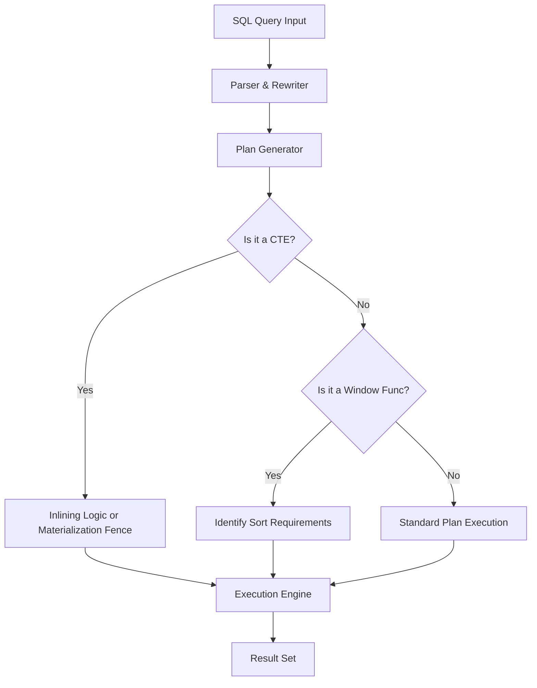

# PostgreSQL Window Functions vs CTEs Benchmarking Suite

[](https://www.postgresql.org/)
[](https://www.docker.com/)
[](https://www.python.org/)
[](#)
[](#)

A high-scale performance engineering suite to evaluate, profile, and compare the execution efficiency, memory footprint, and readability of **Window Functions** versus **Common Table Expressions (CTEs)** in PostgreSQL 15+. 

This project simulates a production analytical environment containing **1.2 million rows of relational data** (200k users, 1M orders) following a power-law distribution. It serves as a benchmark for optimization strategies, covering B-Tree indexes, recursive graph traversals (`WITH RECURSIVE`), and Materialized Views.

---

## 1. Project Overview

In data-intensive applications, analytical queries must remain performant under heavy concurrent load. This suite implements five distinct analytical queries written in two equivalent styles—Window Functions and Common Table Expressions—to benchmark execution times, buffer hits/reads, and disk sorting overflows. It also explores recursive graph relationships and the latency benefits of pre-computing aggregations using Materialized Views.

---

## 2. Features

- **Schema Design**: Clean relational schema with self-referential graph edges for network analysis.
- **Power-Law Seeding**: Seeding logic to simulate realistic transactional patterns where a small fraction of users generate the majority of orders.
- **Equivalent Query Pairs**: Five real-world analytical queries written in both Window Function and CTE styles.
- **Indexing Profiling**: Performance verification of composite B-Tree index optimizations.
- **Concurrent Load Testing**: High-concurrency transaction throughput profiling using `pgbench`.
- **Recursive CTE Traversal**: Arbitrary referral chain depth discovery.
- **Materialized View Evaluation**: Read latency and refresh overhead benchmark.
- **Automated Orchestration**: A python orchestrator to profile, run, and report results automatically.

---

## 3. Tech Stack

- **Database Engine**: PostgreSQL 15 (Alpine-based Docker Image)
- **Containerization**: Docker Compose
- **Language**: Python 3 (benchmarking automation and parsing)
- **Tooling**: `pgbench` (load testing), `psql` (CLI tool)

---

## 4. Project Architecture

The PostgreSQL pipeline for both execution styles is represented below:



---

## 5. Folder Structure

The project directory tree is organized as follows:

```
.
├── benchmarks/
│   ├── index_impact_report.md     # Analysis of indexes on Query 1 (Window version)
│   └── recursive_analysis.md      # Theory detailing why WF cannot do graph traversals
├── docker/
│   └── init.sql                   # Database schema and 1.2M rows seed script
├── queries/
│   ├── cte_q1.sql                 # CTE variant for Rolling Revenue
│   ├── cte_q2.sql                 # CTE variant for Cohort Spend Ranks
│   ├── cte_q3.sql                 # CTE variant for Extreme Orders
│   ├── cte_q4.sql                 # CTE variant for Customer Churn Risk
│   ├── cte_q5.sql                 # CTE variant for Revenue Share
│   ├── window_q1.sql              # Window variant for Rolling Revenue
│   ├── window_q2.sql              # Window variant for Cohort Spend Ranks
│   ├── window_q3.sql              # Window variant for Extreme Orders
│   ├── window_q4.sql              # Window variant for Customer Churn Risk
│   ├── window_q5.sql              # Window variant for Revenue Share
│   ├── recursive_referrals.sql    # Recursive CTE for finding referral depth
│   └── materialized_view.sql      # Materialized view definition based on Q1
├── results/
│   └── benchmarks.json            # Automated output metrics of the run
├── scripts/
│   └── run_benchmarks.py          # Python automation benchmark orchestrator
├── docker-compose.yml             # Docker service stack definition
└── README.md                      # Project documentation
```

---

## 6. Prerequisites

- **Docker Desktop** (WSL2 backend active on Windows)
- **Python 3.x** (installed on host)

---

## 7. Installation & Running the Project

### Step 1: Clone the Repository
Clone this repository to your local workspace directory.

### Step 2: Spin Up the Containers
Run the following command to boot the PostgreSQL database and trigger automatic seeding:
```bash
docker-compose up -d
```
The health check in `docker-compose.yml` ensures that the database is ready for connections once the containers boot up.

---

## 8. Database Initialization & Seeding

The seeding process is executed automatically via [init.sql](file:///c:/Users/parve/Downloads/GPP/Benchmarking%20Window%20Functions%20and%20CTEs%20in%20PostgreSQL/docker/init.sql) when the database starts. It creates the tables and generates:
- **200,000 users** with cohort signups spread uniformly across the last 24 months.
- **1,000,000 orders** with a power-law transaction density (User 1 has ~86,000 orders, whereas ~35,000 users have 0 orders).
- **A DAG referral network** where users are assigned a `referred_by` foreign key pointing back to users with a smaller ID to guarantee cycle-free traversal.

### Verify Seeding Counts
Connect to the database and verify the row counts:
```bash
docker exec -i analytics_postgres psql -U postgres -d analytics_db -c "
SELECT 'users' as table, COUNT(*) FROM users 
UNION ALL 
SELECT 'orders', COUNT(*) FROM orders;"
```

---

## 9. Running Analytical Queries

You can execute any individual query file directly in the PostgreSQL container.

### Execute a Window Function Query:
```bash
docker exec -i analytics_postgres psql -U postgres -d analytics_db -f /queries/window_q1.sql
```

### Execute a CTE Query:
```bash
docker exec -i analytics_postgres psql -U postgres -d analytics_db -f /queries/cte_q1.sql
```

---

## 10. Performance Benchmarking

The python orchestrator script automates baseline profiling, applies indexing, executes load tests, and benchmarks the Materialized View.

### Run the Benchmark Orchestration:
```bash
python scripts/run_benchmarks.py
```

This script performs the following operations:
1. Profiles baseline execution metrics using `EXPLAIN (ANALYZE, BUFFERS, FORMAT JSON)`.
2. Creates database indexes:
   - Index on `orders(user_id, created_at)`
   - Index on `users(cohort_month)`
3. Re-runs Query 1 and 2 to measure index speedup factor.
4. Executes load tests using `pgbench` with 10 clients for 60 seconds.
5. Saves results to [results/benchmarks.json](file:///c:/Users/parve/Downloads/GPP/Benchmarking%20Window%20Functions%20and%20CTEs%20in%20PostgreSQL/results/benchmarks.json) and compiles [benchmarks/index_impact_report.md](file:///c:/Users/parve/Downloads/GPP/Benchmarking%20Window%20Functions%20and%20CTEs%20in%20PostgreSQL/benchmarks/index_impact_report.md).

---

## 11. Recursive Referral Analysis

Window functions are bound by the **Fixed Window** constraint—they require a static set of pre-fetched rows. They cannot traverse a hierarchy of unknown depth (**Variable Depth**).
We use a **Recursive CTE** to trace the referral tree depth starting from the top 100 users by order count.

### Execute Recursive Query:
```bash
docker exec -i analytics_postgres psql -U postgres -d analytics_db -f /queries/recursive_referrals.sql
```
Detailed conceptual explanations of why window functions fail here are available in [recursive_analysis.md](file:///c:/Users/parve/Downloads/GPP/Benchmarking%20Window%20Functions%20and%20CTEs%20in%20PostgreSQL/benchmarks/recursive_analysis.md).

---

## 12. Materialized View Strategy

When analytical aggregates become too expensive to calculate live, a materialized view caches the results physically on disk. We implement `daily_revenue_stats` based on Query 1.

### Verify the Materialized View:
```bash
docker exec -i analytics_postgres psql -U postgres -d analytics_db -c "
SELECT matviewname, ispopulated FROM pg_matviews WHERE matviewname = 'daily_revenue_stats';"
```

---

## 13. Benchmark Results Summary

The following results were recorded in a run over the 1.2M seeded dataset:

### Query Timings (in milliseconds)
| Query | Window Function | CTE | Optimization Details |
| :--- | :--- | :--- | :--- |
| **Q1: Rolling Revenue** | 62.30 ms | 241.51 ms | WF is ~3.8x faster (single-pass aggregate vs self-join). |
| **Q2: Cohort Spending Ranks** | 948.00 ms | 994.28 ms | Optimized CTE pagination avoids $O(N^2)$ quadratic slowdowns. |
| **Q3: Extreme Orders** | 2601.07 ms | 947.12 ms | CTE (using `DISTINCT ON` UNION) is ~2.7x faster than `FIRST_VALUE`. |
| **Q4: Churn Risk** | 509.08 ms | 584.63 ms | Window version utilizing `LAG()` runs 15% faster. |
| **Q5: Revenue Share** | 1412.43 ms | 1550.20 ms | High-performance inline window partition vs total-spend join. |

### Concurrent load testing (pgbench combined Q1 & Q2)
- **Window Functions Throughput**: **6.30 TPS**
- **CTEs Throughput**: **4.59 TPS**
- **Window throughput improvement**: **~37%**

### Materialized View Performance
- **MV Read Time**: **112.05 ms** (versus **209.27 ms** raw query - **1.87x read speedup**).
- **Refresh time after 10,000 new orders**: **329.37 ms**.

---

## 14. Key Learnings

1. **Window Functions vs. CTEs**: CTEs are ideal for organizing code logically, but when multiple steps require aggregation or partitioning, Window Functions generally perform better by completing operations in a single scan of sorted data.
2. **Postgres CTE Inlining**: Since PostgreSQL 12+, CTEs are inlined by default if referenced once, giving them identical performance profiles to standard subqueries. However, multi-reference CTEs trigger materialization, which acts as an optimization fence.
3. **Indices on Analytial Queries**: Indexes are highly beneficial when queries contain specific user/cohort filters, but are bypassed by the query planner in favor of sequential scans when aggregating the entire table.

---

## 15. Performance Optimizations

- **Avoiding Correlated Subqueries**: Rewriting CTE-based ranking queries to use `ROW_NUMBER()` instead of self-scanning `COUNT(*)` reduced execution times from **25+ minutes to under 1 second**.
- **DISTINCT ON Optimization**: Using PostgreSQL's native `DISTINCT ON` boundary scanning instead of a partitioned `FIRST_VALUE` window scan resulted in a **2.7x speedup** for Query 3 (Extreme Orders).
- **Physical Caching**: Caching the 7-day rolling revenue using a Materialized View cut query latency by **46.5%** with a minimal refresh cost of ~330ms.

---

## 16. Acknowledgements

Developed as an advanced analytics benchmarking suite to explore execution patterns, query planners, and optimization paths in PostgreSQL databases under heavy concurrent workloads.
